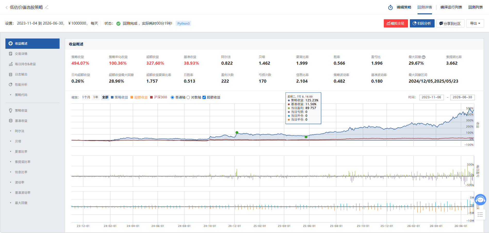
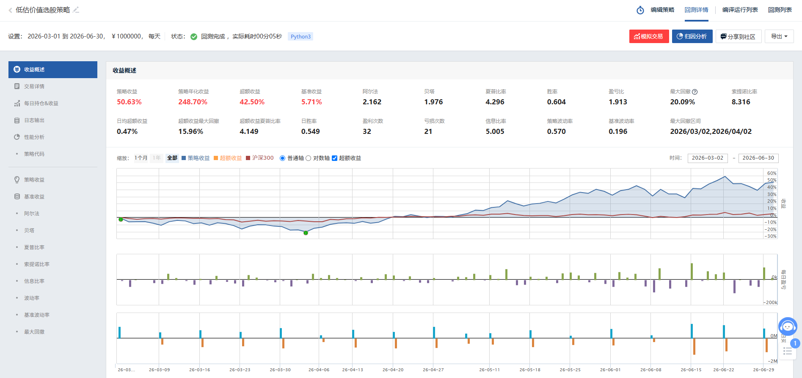
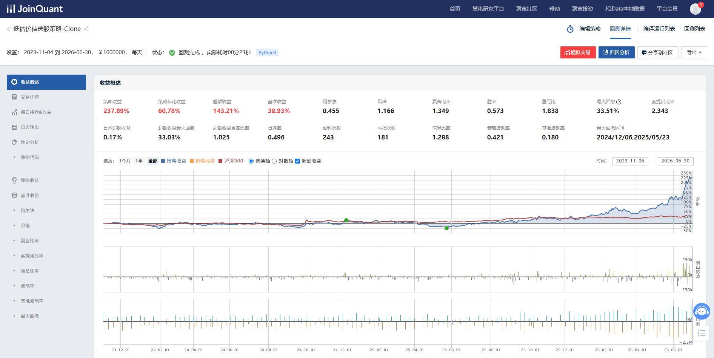
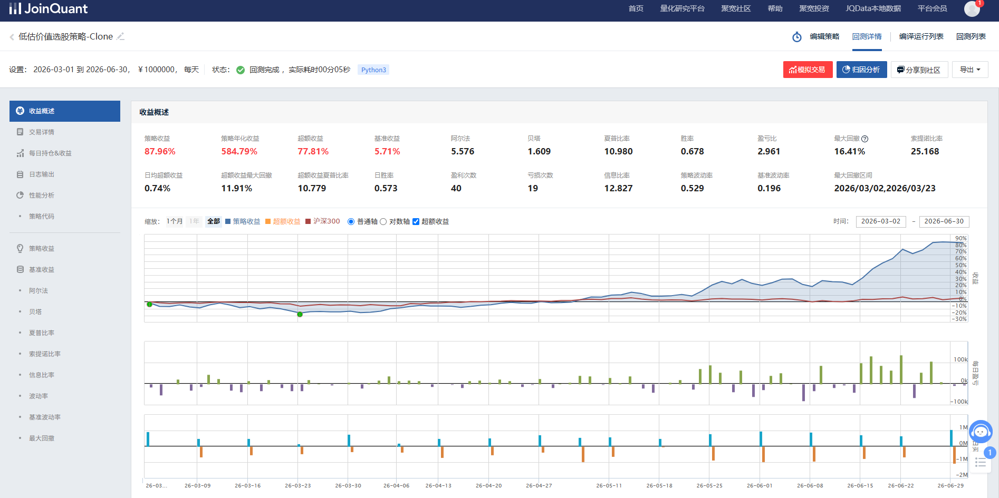
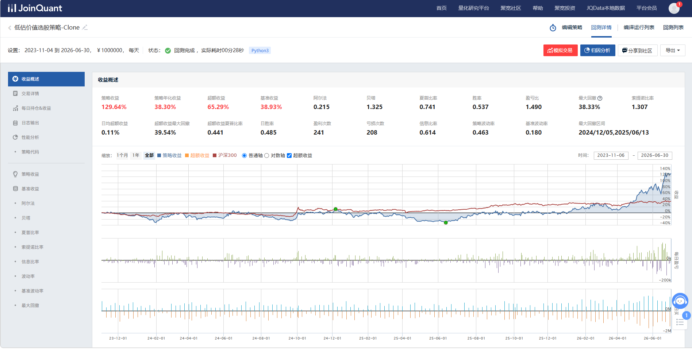
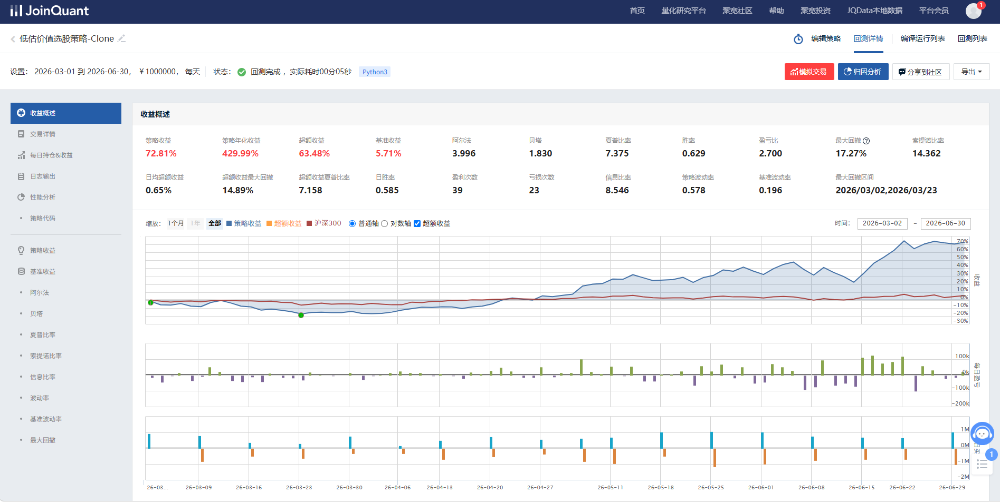
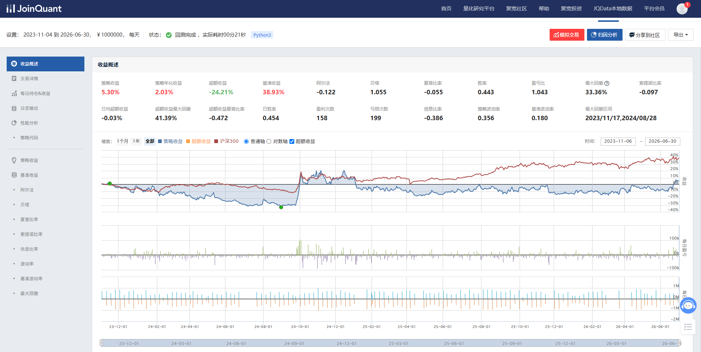
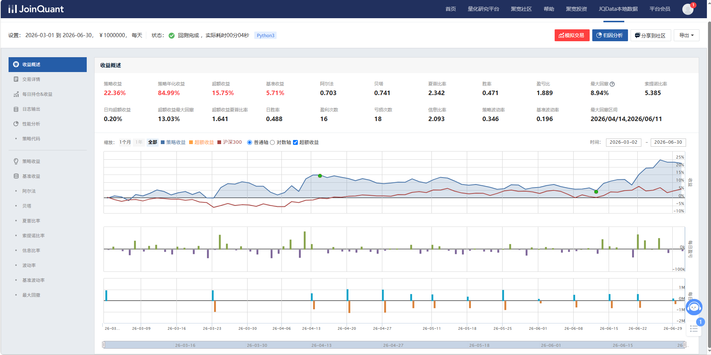

# 「右侧精选」Agent多因子选股策略

## 一、策略核心思想
**紧跟主力资金流动**，通过数据和模拟盘拟合机构决策，重点关注国家养老金、保险业资金走向，在AI Infra上游产业链中精选处于动量上升初期且资金加速流入的标的。

---

## 二、选股阶段：AI Infra上游低位布局

### 2.1 板块筛选范围
| 产业链环节 | 细分领域 | 受益逻辑 |
|---|---|---|
| PCB/覆铜板产业链 | 电子布、覆铜板、PCB（多层板/HDI/封装基板） | AI硬件出货高增，PCB向更多层数、更小线宽线距升级，拉动二代电子布加速出货 |
| 半导体制造材料 | 半导体材料（光刻胶、靶材等） | 依托产能扩张与国产替代实现放量 |
| 光通信材料 | 光纤、光模块设备 | 算力集群高速互联需求，光模块进入高带宽快速更迭周期 |
| 被动元器件材料 | 液冷材料、散热材料 | 高功率GPU驱动液冷渗透率快速提升 |
| 算力金属 | 钨、锡、铟、锗、稀土等小金属 | AI需求系统性抬升小金属需求增速，供给侧管控支撑涨价 |

### 2.2 选股三重条件（需**同时满足**）

#### 条件一：动量评分
- 使用zzshare对股价打分，FinBERT等大模型对近期研报、公告、新闻进行情感与动能分析
- 评分体系涵盖：股价趋势、业绩预期、市场情绪

#### 条件二：市盈率分位 ≤ 80%（已删去）
- 选取行业内市盈率处于历史中低位的个股
- 采用Rank比较，剔除估值过高标的

#### 条件三：资金流入较上周增长 ≥ 80%
- 监测主力资金（大单、超大单）净流入
- 对比本周与上周资金流入均值

### 2.3 选股流程示意图

1. ma5 > ma10: +35分    
2. ma10 > ma20: +25分   
3. close > ma5: +15分   
4. ret5 * 120: 5日涨幅加分 
5. vol_ratio * 12: 量比加分 
6. (stock_10ret - hs_10ret) * 80: 相对强弱 
7. close > ma60: +18分  

## 三、仓位控制

### 3.1 波动率预测短线差价（40%资金）
- 采用核心-卫星配置
- 核心（50%）：配置3只优质AI服务供应，AI转型的科技巨头
- 卫星（50%）：配置2只弹性较高的事件驱动型个股
### 3.2 固定仓位管理（30%资金）
- 低估值的传统板块龙头
### 3.3 资金流向预测短线趋势（30%资金）
- 探索AI上流供应商、深挖关联产业和边缘产业的主力趋势

---

## 四、风险控制体系

### 4.1 VEA监控
- 实时计算组合的VEA指标，突破阈值时触发报警，调整风险敞口

### 4.2 市场状态逻辑切换

| 市场状态 | 策略模式 | 仓位上限 |
|---|---|---|
| 强趋势/牛市 | 进取模式 | 100% |
| 震荡/分化 | 保守模式 | 70% |
| 高波动/下行风险 | 防御模式 | 50% |
| 系统性风险信号 | 清仓/对冲 | ≤ 30% |

根据精选ai infra中上游产业24选5股票的回测如下：

实验一：验证策略是否有效
长期回测：

短期回测：

- 结论：高夏普比率证明收益风险平衡优秀，高信息比率证明策略确实捕捉到了有效市场行情

实验二，ai板块选股池大小重要吗，选股结构有何影响。
实验设计将上游产业股票将选股池拓展到60（核心上中流）-80（核心+边缘相关产业）
长期：

短期：

- 结论：策略依旧有效，总体收益远超指数；长期数据下降，证明策略未能适应24、25年行情，同时说明早期主力未关注部分上游供应商；但短期表现（120天）对比少量股票年化从248增长到548，说明策略非常适合近期市场状态；

80（核心+边缘相关产业）：
长期

短期

结论：策略依旧有效，总体收益远超指数；长期数据再次下降，证明策略与24、25年行情相反，同时说明早期主力未关注上流供应商、深挖关联产业和边缘产业；但短期表现（120天）对比少量股票年化从248增长到423，说明策略非常适合近期市场状态；以外，我认为根据回测的滞后性，可能80选股更适合下半年走向。
- 实验二结论：选股池重要，大选股池过去占劣势，近期则近期明显优势；结构重要，实验表明资金从核心（20）流向上流产业和关联产业（60）趋势明显。

实验三，消融实验，如果舍去板块筛选，策略还有效吗。
长期：

短期：

- 结论：策略短期超过指数，短期依旧有效，进一步验证策略适合近期市场；长期跑输指数，验证策略在低动量市场表现可能适得其反；我本以为策略在其他板块不适用，这次实验的短期表现打破了我的假设。如果有高动量大资金流入，能给金融行业带来动量，策略依旧有效（高过指数）。

持仓：30低估值龙头做仓低，40低位进入ai infra中上游核心，30探索ai上流供应商、深挖关联产业和边缘产业；

暂停键：
英伟达股价跌破20
主力资金撤出超30
dvae？将海量数据压缩到低维空间，若当前状态远离任何历史上升数据状态（接近08.22年状态）则是风险预警的信号。

下一步：更激进的策略？小市值+ETF；更隐藏的板块？封装、电容、橡胶助剂、机床模板；更稳健的风控？何时该暂停、何时该放弃；